# ProReadApp
- [ProReadApp](#proreadapp)
  - [1. Thông Tin Dự Án](#1-thông-tin-dự-án)
  - [2. Giới Thiệu Dự Án](#2-giới-thiệu-dự-án)
  - [3. Các Chức Năng Chính](#3-các-chức-năng-chính)
  - [4. Công nghệ](#4-công-nghệ)
    - [4.1. Công Nghệ Sử Dụng](#41-công-nghệ-sử-dụng)
    - [4.2 Cấu trúc dự án](#42-cấu-trúc-dự-án)
  - [5. Ảnh và Video Demo](#5-ảnh-và-video-demo)
    - [Home Fragment](#home-fragment)
    - [Search Fragment](#search-fragment)
    - [Setting Fragment](#setting-fragment)
    - [Thể loại](#thể-loại)
    - [Đọc truyện](#đọc-truyện)
    - [Thông tin truyện](#thông-tin-truyện)
    - [Thêm truyện \& chương](#thêm-truyện--chương)
    - [Sửa truyện](#sửa-truyện)
    - [Video Demo:](#video-demo)
  - [6. Các Vấn Đề Gặp Phải](#6-các-vấn-đề-gặp-phải)
    - [Vấn Đề 1: Không click được vào truyện mặc dù đã hiện đúng ở TimKiemFragment](#vấn-đề-1-không-click-được-vào-truyện-mặc-dù-đã-hiện-đúng-ở-timkiemfragment)
    - [Vấn Đề 2: Không đồng bộ dữ liệu giữa ViewModel và Fragment sau khi thêm hoặc sửa truyện](#vấn-đề-2-không-đồng-bộ-dữ-liệu-giữa-viewmodel-và-fragment-sau-khi-thêm-hoặc-sửa-truyện)
  - [7. Kết Luận](#7-kết-luận)


## 1. Thông Tin Dự Án

**Tên Dự Án:** [ProReadApp](https://github.com/HandQ2212/ProReadApp)

**Tác giả:** [Nguyễn Nam Hải](https://github.com/HandQ2212)

## 2. Giới Thiệu Dự Án

**Mô tả:** Đây là 1 app chạy local để mọi người có thể đọc các truyện mà mình đã tạo.

## 3. Các Chức Năng Chính

- Đọc truyện nhiều chương.
- Thêm, sửa truyện.
- Chia ra các mục: Mới nhất, Mới cập nhật, Đọc gần đây, Đã hoàn thành.
- Tính năng xem các truyện thuộc thể loại nào đó.
- Tìm kiếm truyện: Tìm kiếm theo tên truyện, tác giả.
- Dark/Night mode, sửa size của chữ khi đọc truyện.

## 4. Công nghệ

### 4.1. Công Nghệ Sử Dụng
**- Ngôn ngữ lập trình và Môi trường:**
  - Dùng ngôn ngữ Java để viết app.
  - Dùng Android Studio để làm IDE chính.
  - 
**- UI và điều hướng:**
  - XML Layout: Thiết kế giao diện người dùng.
  - BottomNavigationView: Thanh điều hướng ở dưới cùng cho các Fragment.
  - Fragment + Navigation Component: Điều hướng giữa các màn hình (Home, Thể loại, Tìm kiếm, Setting).

**- Cơ sở dữ liệu:**
  - Room Database: Lưu trữ dữ liệu truyện, chương, thể loại cục bộ trên thiết bị.
  - LiveData + ViewModel: Hỗ trợ cập nhật dữ liệu UI tự động khi thay đổi.

### 4.2 Cấu trúc dự án
```bash
|   AndroidManifest.xml
|   main.iml
|
+---java
|   \---com
|       \---example
|           \---proreadapp
|               +---adapter
|               |       CategoryAdapter.java
|               |       ChapterAdapter.java
|               |       ChapterListAdapter.java
|               |       MultiSelectionAdapter.java
|               |       SearchAdapter.java
|               |       StoryAdapter.java
|               |
|               +---dao
|               |       CategoryDao.java
|               |       ChapterDao.java
|               |       StoryCategoryDao.java
|               |       StoryDao.java
|               |
|               +---database
|               |       AppDatabase.java
|               |       StoryDatabase.java
|               |
|               +---model
|               |       Category.java
|               |       CategoryWithStories.java
|               |       Chapter.java
|               |       SearchItem.java
|               |       Story.java
|               |       StoryCategoryCrossRef.java
|               |       StoryWithCategories.java
|               |       StoryWithChapters.java
|               |
|               +---repository
|               |       CategoryRepository.java
|               |       ChapterRepository.java
|               |       SearchRepository.java
|               |       StoryRepository.java
|               |
|               +---view
|               |   |   ChapterAddEditActivity.java
|               |   |   ChapterReaderActivity.java
|               |   |   MainActivity.java
|               |   |   ShowListActivity.java
|               |   |   StoryAddEditActivity.java
|               |   |   StoryDetailActivity.java
|               |   |   StoryEditActivity.java
|               |   |   StoryListEditActivity.java
|               |   |
|               |   \---fragment
|               |           HomeFragment.java
|               |           SettingFragment.java
|               |           TheLoaiFragment.java
|               |           TimKiemFragment.java
|               |
|               \---viewmodel
|                       CategoryViewModel.java
|                       ChapterEditLauncher.java
|                       ChapterViewModel.java
|                       HomeViewModel.java
|                       HomeViewModelFactory.java
|                       ReaderSettingViewModel.java
|                       SearchViewModel.java
|                       SearchViewModelFactory.java
|                       ShowListViewModel.java
|                       StoryDetailViewModel.java
|                       StoryEditViewModel.java
|                       StoryViewModel.java
|
\---res
    +---color
    |       bottom_nav_color_selector.xml
    |
    +---drawable
    |   |   bg_description_rounded.xml
    |   |   bg_image_rounded.xml
    |   |   bg_layout_oval.xml
    |   |   bg_layout_oval_xam.xml
    |   |   button_rounded_pink.xml
    |   |   error_book.xml
    |   |   eye_svgrepo_com.xml
    |   |   ic_arrow_right.xml
    |   |   ic_edit.xml
    |   |   ic_home.xml
    |   |   ic_image_placeholder.xml
    |   |   ic_launcher_background.xml
    |   |   ic_launcher_foreground.xml
    |   |   ic_offline.xml
    |   |   ic_setting.xml
    |   |   ic_theloai.xml
    |   |   ic_timkiem.xml
    |   |   love_svgrepo_com.xml
    |   |   mucthanky.jpg
    |   |   mucthanky1618392290.jpg
    |   |   placeholder_book.xml
    |   |   sample_cover_1.xml
    |   |   sample_cover_2.xml
    |   |   textview_border.xml
    |   |   trending_up_svgrepo_com.xml
    |   |
    |   \---menu
    +---layout
    |   |   activity_chapter_add_edit.xml
    |   |   activity_main.xml
    |   |   activity_show_list.xml
    |   |   activity_story_add_edit.xml
    |   |   activity_story_detail.xml
    |   |   activity_story_edit.xml
    |   |   activity_story_list_edit.xml
    |   |   dialog_add_category.xml
    |   |   dialog_font_settings.xml
    |   |   doc_truyen_xml.xml
    |   |   fragment_home.xml
    |   |   fragment_offline.xml
    |   |   fragment_setting.xml
    |   |   fragment_the_loai.xml
    |   |   fragment_tim_kiem.xml
    |   |   item_category.xml
    |   |   item_category_selectable.xml
    |   |   item_chapter.xml
    |   |   item_search_result.xml
    |   |   item_story.xml
    |   |
    |   \---fragment
    +---menu
    |       bottom_nav_menu.xml
    |
    +---mipmap-anydpi-v26
    |       ic_launcher.xml
    |       ic_launcher_round.xml
    |
    +---mipmap-hdpi
    |       ic_launcher.webp
    |       ic_launcher_round.webp
    |
    +---mipmap-mdpi
    |       ic_launcher.webp
    |       ic_launcher_round.webp
    |
    +---mipmap-xhdpi
    |       ic_launcher.webp
    |       ic_launcher_round.webp
    |
    +---mipmap-xxhdpi
    |       ic_launcher.webp
    |       ic_launcher_round.webp
    |
    +---mipmap-xxxhdpi
    |       ic_launcher.webp
    |       ic_launcher_round.webp
    |
    +---navigation
    |       nav_graph.xml
    |
    +---values
    |       colors.xml
    |       strings.xml
    |       style.xml
    |       themes.xml
    |
    +---values-night
    |       colors.xml
    |       themes.xml
    |
    +---values-v26
    |       style.xml
    |
    \---xml
            backup_rules.xml
            data_extraction_rules.xml
```


## 5. Ảnh và Video Demo

### Home Fragment
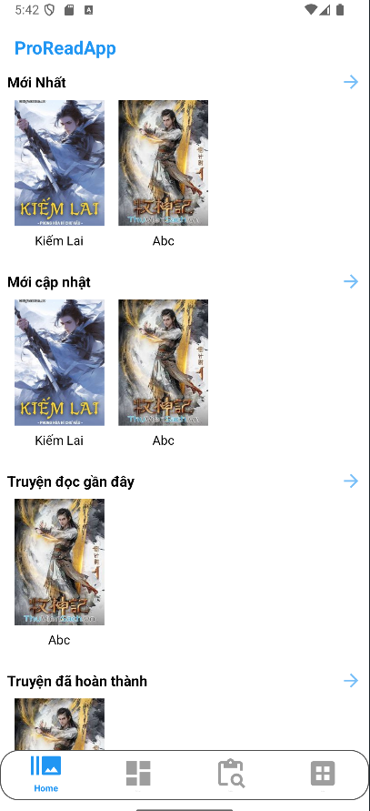 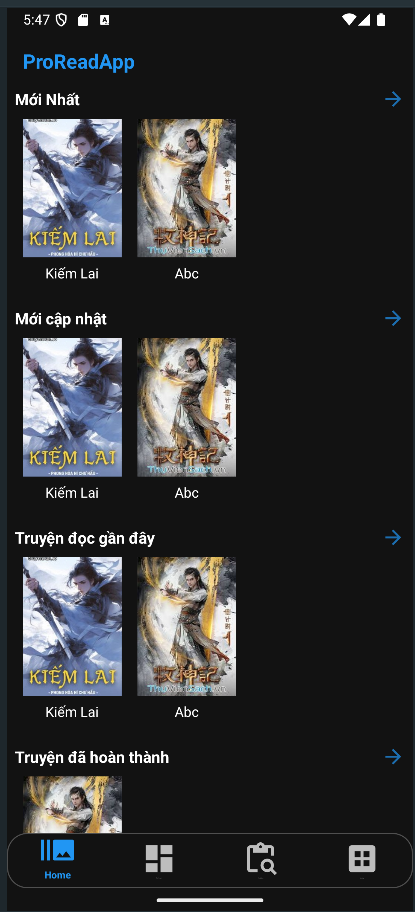

### Search Fragment
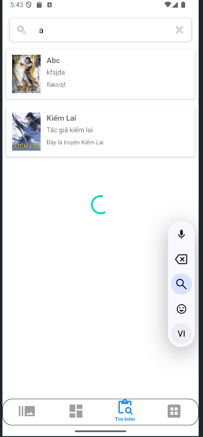 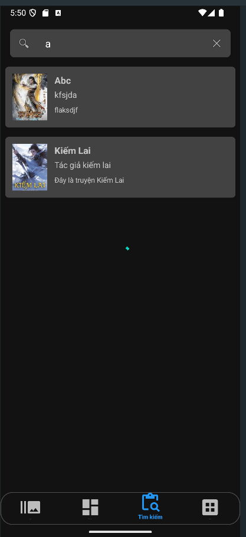

### Setting Fragment
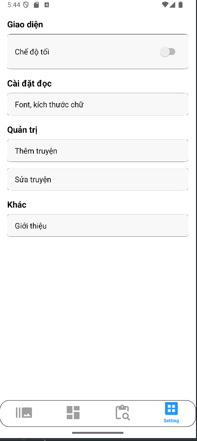 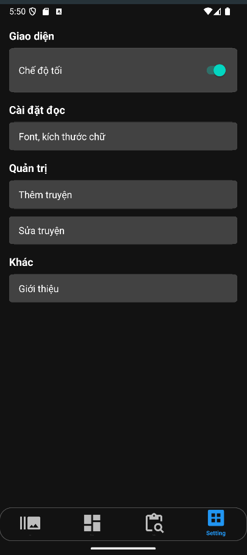

### Thể loại
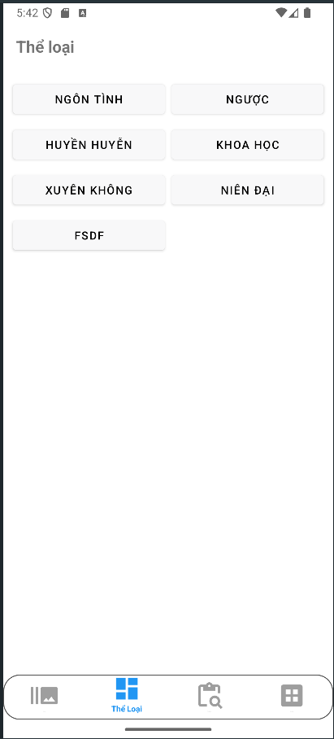 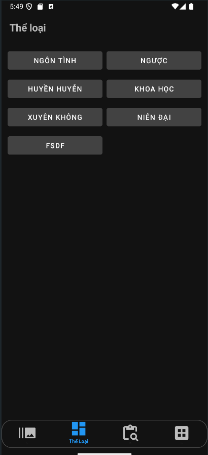

### Đọc truyện
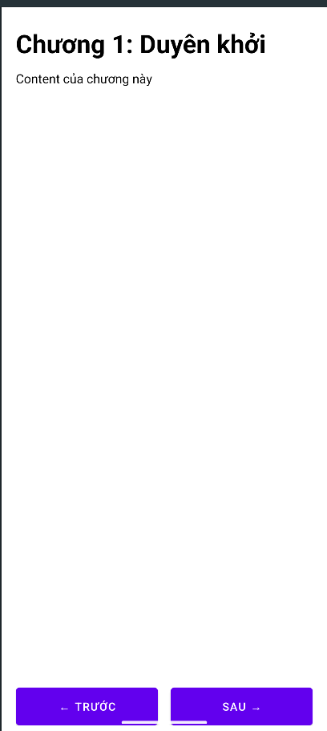 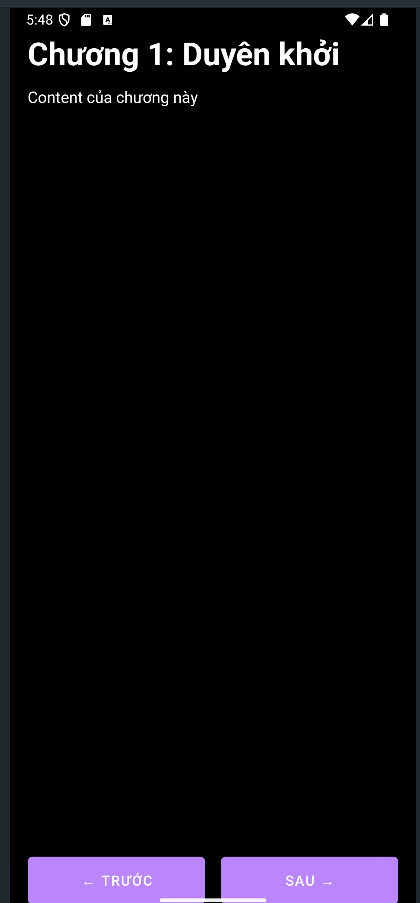

### Thông tin truyện
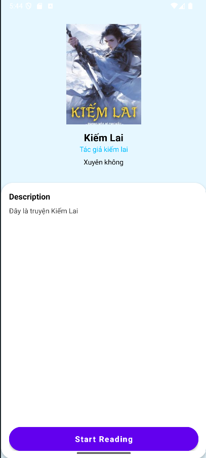 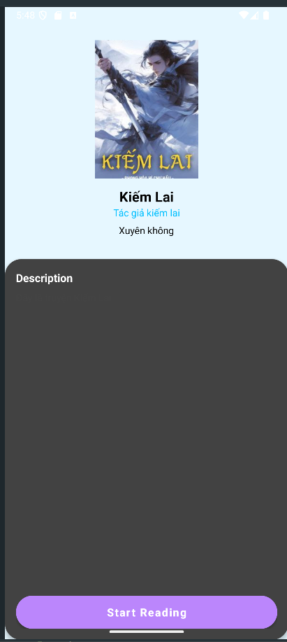

### Thêm truyện & chương
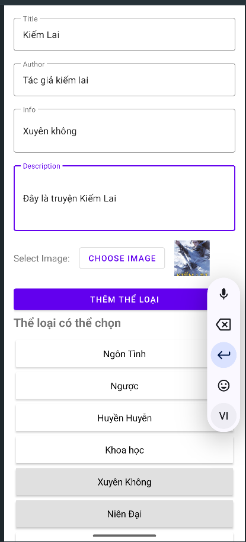 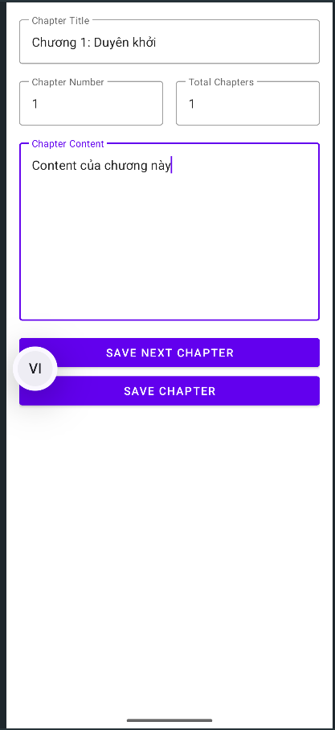

### Sửa truyện
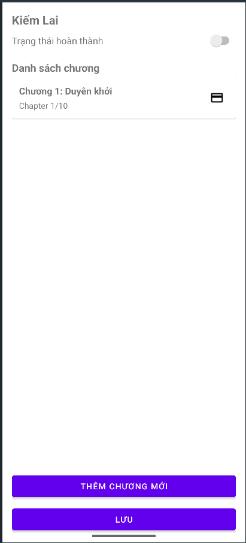 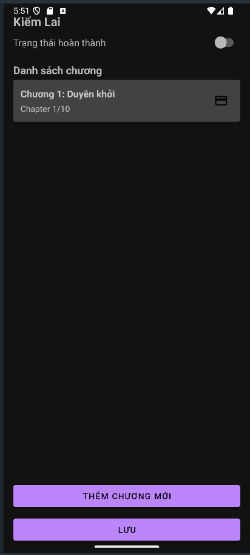

### Video Demo:
[Video Demo](https://www.youtube.com/watch?v=jSl02kh8GNg&feature=youtu.be)


## 6. Các Vấn Đề Gặp Phải

### Vấn Đề 1: Không click được vào truyện mặc dù đã hiện đúng ở TimKiemFragment

**Mô tả:** Khi tìm kiếm truyện trong `TimKiemFragment`, click vào item không chuyển sang `StoryDetailActivity`.

**Giải Quyết:** Cài đặt `OnItemClickListener` trong `SearchAdapter`, truyền `storyId` qua `Intent` để mở chi tiết truyện.

**Kết Quả:** Người dùng có thể click vào truyện tìm được và xem chi tiết ngay, đảm bảo luồng truy cập trực quan.

### Vấn Đề 2: Không đồng bộ dữ liệu giữa ViewModel và Fragment sau khi thêm hoặc sửa truyện

**Mô tả:** Sau khi thêm truyện mới trong `StoryAddEditActivity`, khi quay lại `HomeFragment`, danh sách không tự cập nhật.

**Giải Quyết:** Truyền `LiveData` qua `ViewModel`. Sử dụng Room kết hợp `LiveData<List<Story>>` để tự động cập nhật khi dữ liệu thay đổi.

**Kết Quả:** Dữ liệu hiển thị trong `RecyclerView` được cập nhật tự động, không cần gọi lại thủ công. UX tốt hơn, tránh lỗi đồng bộ.

## 7. Kết Luận

**Kết quả đạt được:** Hiểu rõ hơn về cách hoạt động của các mô hình, cách truyền dữ liệu, làm việc với cơ sở dữ liệu. Tối ưu việc truyền qua lại.

**Hướng phát triển tiếp theo:** Sửa lại các bug và cập nhật lên việc sử dụng các database như Firestore, ... để có thể cập nhật dữ liệu từ server, khi ấy có thể có nhiều người dùng hơn. Song song với đó thì vẫn cần việc chạy local để khi người dùng không có mạng thì vẫn có thể đọc được các truyện đã tải từ trước.